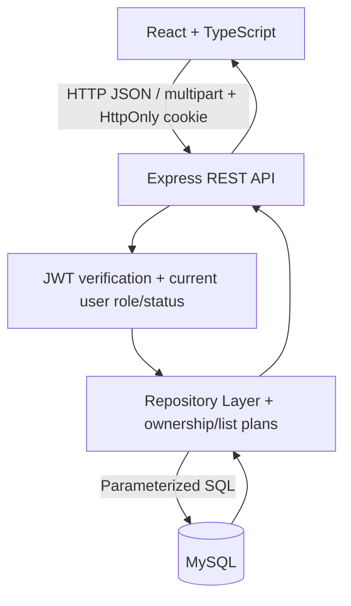
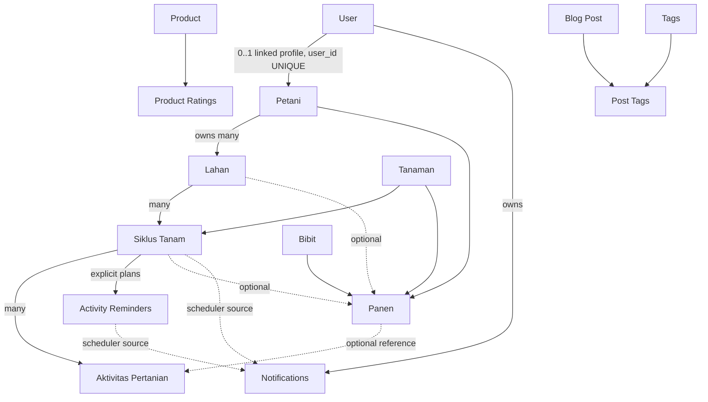

# Architecture

## Request flow

Frontend pages/hooks mengelola tampilan, form, URL filters dan request cancellation. `apiFetch` membawa cookie, menampilkan error aman dan mempertahankan AbortError. `AuthContext` memperoleh identitas dari `/auth/me`; local cache tidak memberi hak akses. Express memverifikasi JWT serta akun approved/aktif, lalu membaca role dari database. Repository menangani query dan persistence; constraint MySQL menegakkan hubungan data dan uniqueness.

## Ownership and relationships

`petani.user_id` nullable unique memberi hubungan akun-profil eksplisit. Lahan menunjuk Petani; Siklus menunjuk Lahan dan Tanaman; Aktivitas menunjuk Siklus. Scope akun Petani diturunkan lewat `siklus -> lahan -> petani.user_id`, bukan user_id dari body. Read detail profil Petani juga memeriksa pemilik saat akun Petani login. Akun tanpa profil menghasilkan data kosong.

Panen menunjuk Petani/Tanaman/Bibit dan dapat mempunyai `lahan_id`/`siklus_tanam_id` nullable. Teks lahan legacy tetap dipertahankan dan tidak dipetakan otomatis berdasarkan nama. LEFT JOIN menjaga record legacy pada daftar/laporan. Form Panen UI masih memakai opsi lahan legacy, sedangkan API mendukung relasi eksplisit yang harus cocok. Karena itu demo browser tidak mengklaim setiap Panen UI terhubung ke Siklus.

Notifications mempunyai FK user dan entity reference bertipe/ID; entity reference tersebut bukan FK polymorphic ke semua sumber. Scheduler merekonsiliasi notifikasi unread ketika sumber tidak lagi valid. Product/Blog adalah domain publik yang terpisah dari ownership farming. Product Ratings menggunakan unique product + user_identifier; Blog memakai tags melalui join table. Model identity rating legacy tidak disamakan dengan FK user farming.

## Roles and trust boundary

| Aksi | Admin | Petani | Penyuluh |
| --- | --- | --- | --- |
| Dashboard Admin | Ya | Tidak | Tidak |
| Dashboard personal | Tidak | Milik sendiri | Tidak |
| Master/Panen writes, approval/link | Ya | Tidak | Tidak |
| Lahan/Siklus/Aktivitas read | Semua | Milik sendiri | Semua |
| Siklus/Aktivitas/Jadwal create/update | Ya | Milik sendiri | Tidak |
| Farming delete | Ya | Tidak | Tidak |
| Reports | Semua | Scope sendiri | Semua |
| Notification read/read-all | Akun sendiri | Akun sendiri | Akun sendiri |

Frontend route/menu meningkatkan UX; authorization tetap dilakukan oleh API. Beberapa GET master/Panen masih publik untuk kompatibilitas, sehingga ownership saat login tidak berarti keseluruhan data legacy bersifat privat. Kebijakan tersebut perlu ditetapkan sebelum memakai data pribadi nyata. Role `user` masih legacy dan tidak otomatis memperoleh akses endpoint Petani.

## Lists, dashboards and reports

`listQuery.ts` memvalidasi ID, tanggal, page/limit/search dan sort whitelist. `listPlans.ts` berbagi scope/filter antara list dan export. LIMIT/OFFSET menggunakan string angka tervalidasi untuk kompatibilitas prepared statements MySQL2.

Dashboard menggunakan agregasi SQL per periode, tidak mengandalkan data list yang sedang dipaginasi. Grafik panen menghitung kejadian. Kolom DATE dikembalikan MySQL2 sebagai `YYYY-MM-DD`; DATETIME/TIMESTAMP tetap timestamp. Ini menghindari perbandingan string-versus-Date yang melewati validasi tanggal atau menggeser kalender WIB. Frontend membuat batas periode melalui helper WIB.

Report backend membaca seluruh hasil filter dengan cap 5.000 baris, batas ukuran, typed XLSX cells, metadata dan mitigasi formula CSV. Excel/CSV didownload oleh browser; tidak ada PDF.

## Notifications and scheduler

`reminderScheduler` berjalan in-process saat startup dan berkala. Sumber tanam/estimasi panen berasal dari Siklus aktif; pemupukan/pengobatan berasal dari jadwal eksplisit, bukan histori aktivitas. Eligible owner harus Petani approved/aktif yang terhubung ke lahan.

INSERT SELECT menggunakan unique event `(user_id,type,related_entity_type,related_entity_id,event_date,scheduled_at)`. Pengulangan tidak menambah event identik atau mereset read state. API notification selalu menggunakan user_id login; mark-one/read-all tersimpan di MySQL. Bell polling 60 detik pada tab terlihat; account switch membersihkan state. Toast `NotificationContext` terpisah dari notification persisten. Tidak ada layanan email/WhatsApp.

Unique key menjaga duplikasi event, namun bukan pengganti observability, coordinator job queue atau audit race conditions beberapa instance. Jadwal baru muncul setelah tick berikutnya; tidak ada endpoint publik untuk memaksa scheduler.

## UI, storage and runtime

DashboardLayout menyediakan main landmark/skip link, sidebar desktop/mobile, dialog keyboard dan bell. Komponen form menjalankan native validation dan async submit lock. Tabel memakai scroll region; dashboard cards/charts responsive. Public image preloader/cache tetap dipakai.

Upload disimpan dalam subfolder products/posts/petani di UPLOAD_DIR. Multer memeriksa metadata extension/MIME dan ukuran, memakai UUID filename, kemudian Express melayani root yang sama dengan nosniff. Content/magic-byte scanning dan orphan cleanup belum tersedia.

Canonical migrations 001-013 tercatat di schema_migrations. Runner menggunakan INFORMATION_SCHEMA untuk guard kolom historical SQL; index/constraint recovery setelah kegagalan parsial perlu review karena DDL auto-commit. Tidak ada DROP/TRUNCATE pada canonical migration.

## Validation boundaries

Fresh setup pada MySQL 8.0.44 menghasilkan 16 tabel/17 FK termasuk ownership link dan notification dedup index. Final integration menggunakan server Express sebenarnya, MySQL sebenarnya, API CRUD, ownership, export serta persisted reminders. UI pass memakai Chrome headless dengan data dummy. Test standar Tahap 8-11 tetap menggunakan mock/fixture dan tidak membuktikan persistence sendirian.

Database existing tidak dimigrasikan. Manual human sign-off, browser lain, real mobile device, destructive delete flows dan seluruh Product/Blog CRUD belum diverifikasi pada pass ini. Logout menghapus cookie/session tetapi bearer JWT yang sudah dicuri belum otomatis dicabut. [FINAL-VALIDATION.md](FINAL-VALIDATION.md) dan [TECHNICAL-DEBT.md](TECHNICAL-DEBT.md) menjadi batas klaim readiness.
