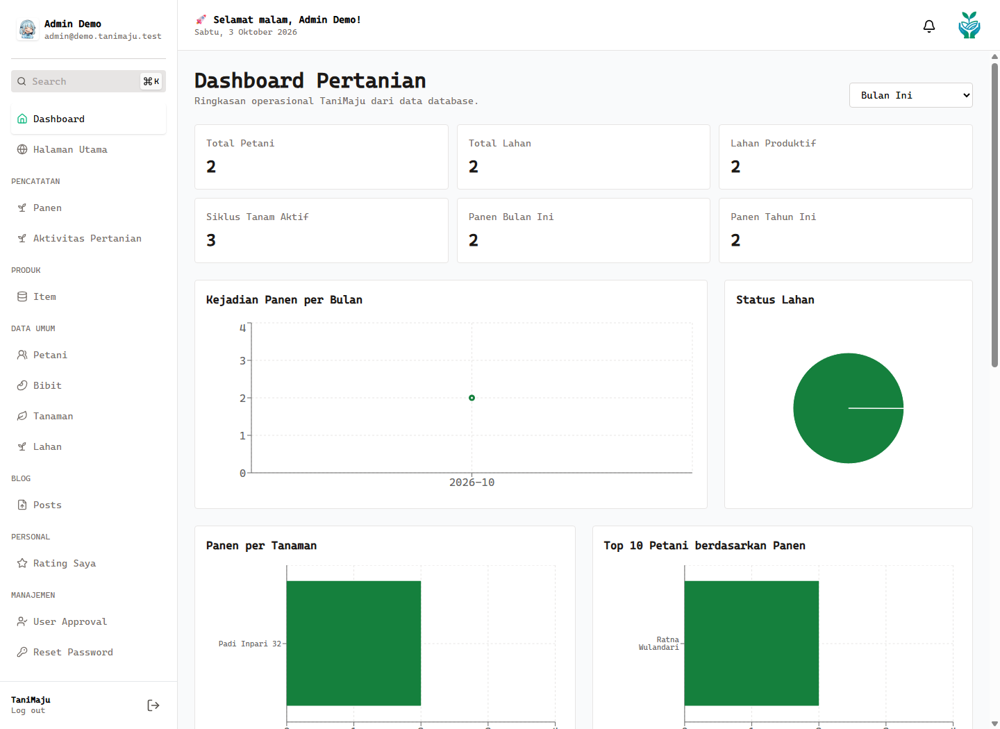

# TaniMaju

Validasi runtime terbaru (3-4 Oktober 2026): [bukti validasi](docs/validation/README.md). Demo lokal menggunakan frontend `http://localhost:5180` dan API `http://localhost:5310` dengan database demo terpisah.

## Overview

TaniMaju adalah aplikasi full-stack untuk pengelolaan pertanian desa, dengan website publik dan dashboard operasional. Fokus engineering mencakup autentikasi, role-based access, pembatasan data berdasarkan pemilik, relasi data pertanian, laporan, serta notifikasi dalam aplikasi.

**Status:** siap untuk portfolio dan demo lokal menggunakan database demo lengkap. Ini bukan klaim production-ready. Bukti pengujian dan batas cakupan ada di [docs/validation](docs/validation/README.md).

## Problem

Pencatatan Petani, lahan, jadwal tanam, aktivitas lapangan dan hasil panen yang terpisah menyulitkan pemantauan. Pengguna juga memerlukan akses berbeda: Admin mengelola data, Petani melihat data sendiri, dan Penyuluh membaca informasi pertanian.

## Solution

Satu alur data menghubungkan akun Petani dengan profil, Lahan, Siklus Tanam dan Aktivitas. Backend menerapkan role serta ownership, dashboard mengambil agregasi MySQL, dan export memakai filter yang sama dengan daftar. Pengingat jadwal disimpan dalam database agar status dibaca dan deduplikasi tidak hanya bergantung pada state browser.

## Main Features

- Registrasi Petani pending, approval Admin, login/logout dan penghubungan profil secara eksplisit.
- Pengelolaan Petani, Tanaman, Bibit, Lahan, Panen, Siklus Tanam dan Aktivitas Pertanian.
- Dashboard Admin dan dashboard personal Petani; angka panen pada grafik adalah jumlah kejadian, bukan total berat.
- Search, pagination, sorting whitelist dan filter tanggal/entity.
- Laporan Panen, Aktivitas, Petani, Tanaman dan Lahan dalam Excel/CSV, mengikuti scope akun dan seluruh hasil filter (maksimal 5.000 baris).
- Notifikasi persisten, unread count, read/read-all, reminder tanam, pemupukan, pengobatan dan perkiraan panen dalam WIB.
- Katalog produk, rating dan blog publik; upload gambar lokal dengan validasi dasar.
- Sidebar mobile, label form, fokus keyboard, loading/error/empty state dan pencegahan submit ganda.

## Tech Stack

| Layer | Teknologi |
| --- | --- |
| Frontend | React 18, TypeScript, Vite 6, React Router, Tailwind CSS, Radix UI, Recharts |
| API | Express 5, TypeScript, MySQL2, bcryptjs, JWT, cookie-parser, Multer |
| Database | MySQL 8; fresh migration dan integration pass diuji pada MySQL 8.0.44 |
| Reports | SheetJS XLSX dan CSV dari backend |
| Testing | Node `node:test`, SQL fixtures, opt-in real MySQL/HTTP integration, Chrome headless CDP |

## Architecture

```text
React + TypeScript
  -> Express REST API (authentication, role, validation)
    -> Repository Layer (ownership, parameterized SQL)
      -> MySQL (foreign keys, unique indexes, persistent data)
```

Ownership mengikuti `User -> Petani -> Lahan -> Siklus Tanam -> Aktivitas Pertanian`. Lihat [ARCHITECTURE.md](ARCHITECTURE.md) untuk relasi, trust boundary dan keputusan desain.

## Roles

| Role | Akses |
| --- | --- |
| Admin | Dashboard seluruh pertanian, approval/link Petani, master CRUD, Panen, farming, laporan |
| Petani | Dashboard pribadi, data farming miliknya, membuat/mengubah siklus dan aktivitas sendiri, jadwal dan export dalam scope sendiri |
| Penyuluh | Baca data pertanian dan laporan; tidak membuka dashboard/Admin approval atau menulis farming |
| user | Role legacy dipertahankan; tidak otomatis mendapat izin API Petani |

CRUD master/Panen dan penghapusan farming tetap Admin. **Panen Saya** tersedia sebagai panel di dashboard Petani; tidak ada halaman CRUD Panen khusus Petani. Beberapa GET master/Panen legacy masih publik: pembatasan Petani yang sedang login bukan kebijakan privasi menyeluruh untuk data tersebut. Batasan keamanan dan kesiapan deployment diringkas pada bagian Security di bawah.

## Screenshots

Screenshot berasal dari browser aplikasi yang berjalan dengan **data fiktif** pada database demo, tanpa token atau password database. [Daftar lengkap dan konteks capture](docs/screenshots/README.md).

| Tampilan | Bukti |
| --- | --- |
| Landing page | [Screenshot](docs/screenshots/landing-page.png) |
| Admin Dashboard | [Screenshot](docs/screenshots/admin-dashboard.png) |
| Petani Dashboard | [Screenshot](docs/screenshots/petani-dashboard.png) |
| Lahan | [Screenshot](docs/screenshots/lahan.png) |
| Aktivitas Pertanian | [Screenshot](docs/screenshots/aktivitas-pertanian.png) |
| Reporting/Export | [Screenshot](docs/screenshots/reporting-export.png) |
| Notification | [Screenshot](docs/screenshots/notification.png) |
| Petani mobile | [Screenshot](docs/screenshots/petani-mobile.png) |



## Installation

Prasyarat: Node.js 22/24, npm, MySQL 8 yang berjalan. Versi engine lain belum mendapat fresh DDL validation dalam pass ini.

```powershell
# Root project: frontend
npm ci
# Backend
cd backend
npm ci
cd ..
```

Untuk setup baru, salin `.env.frontend.example` menjadi `.env` di root dan `backend/.env.example` menjadi `backend/.env`. Jika sudah ada `.env`, tambahkan key yang diperlukan tanpa menimpanya. Setelah environment dan migration siap, jalankan `npm run dev` dari backend dan root dalam dua terminal. Untuk demo dengan port yang digunakan oleh screenshot, jalankan `scripts/start-local-demo.ps1 -Target backend` dan `scripts/start-local-demo.ps1 -Target frontend` di dua terminal. Untuk backend hasil build: jalankan `npm run build` lalu `npm start` dari folder backend.

## Environment Setup

| Lokasi/key | Konfigurasi lokal |
| --- | --- |
| Frontend `VITE_API_URL` | `http://localhost:5000/api` |
| Frontend `VITE_API_URL_IMAGE` | `http://localhost:5000` |
| Frontend `VITE_MAPBOX_TOKEN` | Token publik dengan pembatasan origin untuk peta; bukan secret server |
| Backend `NODE_ENV`, `PORT` | `development`, `5000` |
| Backend `CLIENT_URL` | Origin frontend tepat, misalnya `http://localhost:5173`; bisa dipisahkan koma |
| Backend `JWT_SECRET` | Rahasia acak unik; production wajib minimal 32 karakter |
| Backend `MYSQL_HOST`, `MYSQL_PORT` | Host database, default `localhost`, `3306` |
| Backend `MYSQL_USER`, `MYSQL_PASSWORD` | Kredensial lokal; akun runtime production harus terbatas |
| Backend `MYSQL_DATABASE` | Nama database target yang disengaja; default kode `website_tanijuu_mysql` |
| Backend `UPLOAD_DIR`, `MAX_FILE_SIZE` | Default `uploads`, 5 MB; batas konfigurasi maksimum 10 MB |

Semua `VITE_` terlihat oleh browser. Jangan menaruh JWT secret atau password database di frontend. Cookie autentikasi HttpOnly, SameSite=Lax, Secure pada production; HTTPS dan topology situs yang sesuai diperlukan saat deployment.

Reminder default: `REMINDERS_ENABLED=true`, interval 30 menit, jam 09:00 WIB, catch-up 48 jam, lead tanam `1,0`, panen `7,3,1`, aktivitas `1,0`. Key opsional lengkap tersedia di `backend/.env.example`. Set `REMINDERS_ENABLED=false` sebelum skema 013 siap. Scheduler hanya berjalan ketika backend hidup; tidak mengirim email/WhatsApp.

## Database Migration

Untuk **database baru/kosong**, jalankan dari folder backend dan gunakan canonical runner:

```powershell
cd backend
$env:MYSQL_DATABASE='tanimaju_demo_nama_unik_baru'
npm run db:migrate
```

Alternatif tanpa loader `tsx`, hasilnya memakai runner yang sama:

```powershell
npm run build
if ($LASTEXITCODE -eq 0) { node dist/database/migrate.js }
```

Perintah alternatif di atas juga dijalankan dari folder `backend`.

Migration 001-013 membuat master, users, rating, ownership, Lahan, Siklus, Aktivitas, jadwal dan notifications. Runner menyiapkan guard kolom melalui INFORMATION_SCHEMA dan mencatat migration berhasil. File SQL historis tidak diubah. DDL bisa auto-commit; kegagalan parsial perlu pemeriksaan sebelum retry.

**Hasil validasi 3 Oktober 2026:** database `tanimaju_demo_20261003_final5` memiliki 13 migration, 16 tabel dan 17 foreign key. Database existing `website_tanijuu_mysql` tetap tidak dimigrasikan dan belum memiliki prasyarat farming/013. Detail hasil schema tersedia di [schema.json](docs/validation/schema.json).

Fresh setup tidak membuat Admin otomatis. Provision Admin secara terkontrol dengan bcrypt, status approved dan is_active true. Dataset portfolio memakai database demo terpisah dan script persiapan yang bersifat opt-in; jangan gunakan database existing berisi data pribadi.

## Testing

```powershell
# Root
npm run typecheck
npm run build
npm test
npm run lint
# Backend: SELECT-only SQL/CTE checks
cd backend
npm run test:mysql
```

`npm test` menjalankan 16 test Tahap 8-11 dengan HTTP lokal dan mock/fixture; bukan bukti seluruh workflow memakai database nyata. Pass tambahan pada database baru menjalankan **17 kelompok real MySQL/HTTP checks**, disusul pengujian UI pada Chrome headless. Script integration menolak database tanpa prefix demo, memerlukan opt-in dan tidak menghapus data.

[Bukti JSON](docs/validation/) membedakan fixture, database nyata, browser otomatis serta pemeriksaan manual manusia. Lint dijalankan melalui `npm run lint`; hasil validasi runtime tidak menjadi klaim bahwa seluruh lint atau deployment production sudah lulus.

## Security

- Password bcrypt; registrasi memaksa Petani pending dan role runtime dibaca dari DB.
- Role middleware dan ownership server menjaga farming/detail/export; parameter request tidak menjadi sumber pemilik.
- Query nilai memakai bound parameters; kolom sorting berasal dari whitelist.
- Notification selalu scoped ke user login, termasuk Admin; unique event mencegah duplikasi tanpa mereset read history.
- CSV formula escape, batas baris/ukuran export; backend tidak menerima workbook upload.
- Upload JPEG/PNG/WebP/GIF memakai batas ukuran, MIME/extension allowlist dan filename UUID; JSON body dibatasi dan header nosniff aktif.

Keterbatasan meliputi revocation bearer JWT setelah logout, GET publik legacy, upload content inspection, rate limiting dan dependency review. Jangan gunakan data nyata atau deploy ke production sebelum kontrol tersebut ditinjau.

## Project Structure

```text
src/
  components/       UI bersama, filter, report export, notification bell
  context/          auth server identity dan toast lokal
  hooks/            list filters, notification, preload
  lib/              API client dan rentang tanggal WIB
  pages/            publik, login/register dan dashboard
backend/
  src/routes/mysql/ REST API aktif
  src/middleware/   auth/role dan upload
  src/repositories/ persistence, ownership, list/report plans
  src/services/     in-app reminder scheduler
  src/database/     runner dan migrations 001-013
  tests/            fixture tests dan opt-in integration pass
scripts/            Chrome CDP browser validation
docs/              screenshots dan bukti validation
```

## Future Improvements

Prioritas berikutnya: memperjelas kebijakan data publik, revocation/session enforcement, lint legacy, dependency/security review, observability scheduler, storage upload dan bundle optimization. PDF, email/WhatsApp notification, multi-instance job queue, CI end-to-end, serta editor siklus/aktivitas lengkap di UI belum dibuat. Tidak ada penambahan fitur pada final pass ini.

[Narasi interview/summary recruiter](INTERVIEW-NOTES.md) dan bukti pada [docs/validation](docs/validation/README.md) membantu menjelaskan project tanpa mengklaim kontribusi pribadi atau kepemilikan seluruh codebase yang belum dikonfirmasi.
